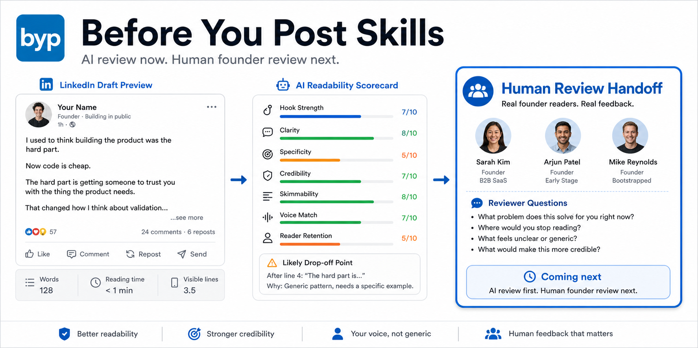
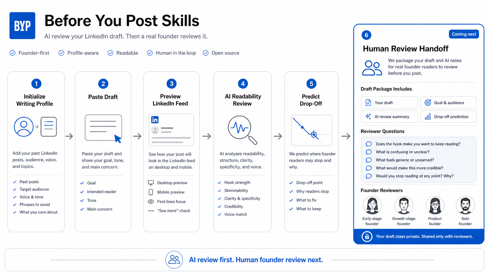

# Before You Post Skills



Open skills for reviewing founder LinkedIn drafts before publishing.

These skills help agents answer one narrow question:

```text
Will founder readers keep reading this draft, trust it, and understand why it matters?
```

## Mission

Help founders publish clearer, more credible LinkedIn posts by giving agents reusable review workflows for hook clarity, audience fit, specificity, credibility, human voice, skimmability, reader drop-off, and human-review handoff.

## Pipeline



The core skill starts by initializing or loading the founder's writing profile when available:

- Past LinkedIn posts.
- Writing style examples.
- Target audience.
- Product/founder context.
- Voice preferences.
- Phrases to avoid.
- Topics they want to own.

Then it runs this review pipeline:

1. Load or initialize writing profile.
2. Preview the draft as a LinkedIn feed post.
3. Review the hook and first visible lines.
4. Check audience fit.
5. Check skimmability and formatting.
6. Find clarity, specificity, and evidence gaps.
7. Judge credibility and human voice against the user's own style.
8. Predict where founder readers may stop.
9. Suggest minimal edits that preserve voice.
10. Package a human-review handoff when requested.

## Included Skills

```text
skills/social-media/linkedin-founder-post-review/
```

This repo intentionally starts with one strong skill instead of many weak ones.

## Not Included In Core

These are common in social media tools but excluded from the first core skill because they dilute the founder-reader review wedge:

- Engagement prediction.
- Virality scoring.
- Hashtag generation.
- Scheduling.
- Content calendar planning.
- Generic quote generation.
- Generic motivational rewrite.
- Broad cross-platform repurposing.
- AI detection claims.

## Install

Use `npx`:

```bash
npx before-you-post-skills
```

By default this installs the core skill into both:

```text
.claude/skills/linkedin-founder-post-review/
.codex/skills/linkedin-founder-post-review/
.claude/commands/byp-init.md
.claude/commands/byp-review.md
.codex/commands/byp-init.md
.codex/commands/byp-review.md
```

Install for one target:

```bash
npx before-you-post-skills --target claude
npx before-you-post-skills --target codex
npx before-you-post-skills --target hermes
```

Install into a specific project directory:

```bash
npx before-you-post-skills --dir /path/to/project
```

Replace an existing install:

```bash
npx before-you-post-skills --force
```

Manual install also works. Copy the skill folder into an agent-compatible skills directory.

Claude-style:

```text
.claude/skills/linkedin-founder-post-review/
```

Codex-style:

```text
.codex/skills/linkedin-founder-post-review/
```

Hermes-style:

```text
skills/social-media/linkedin-founder-post-review/
```

## Usage

After installing, use the slash-command workflow.

### Step 1: Initialize Your Writing Profile

Run:

```text
/byp-init
```

The agent should ask for:

- Target audience.
- Voice.
- Phrases or tone to avoid.
- 2-5 previous LinkedIn posts or writing examples.

It stores the result in:

```text
BYP-WRITING-PROFILE.md
```

### Step 2: Review A Draft

Run:

```text
/byp-review
```

The agent loads `BYP-WRITING-PROFILE.md`, then asks for the draft, intended reader, post goal, and concern.

Manual invocation also works:

```text
Use the linkedin-founder-post-review skill.

My writing profile:
- Past posts: [paste 2-5 examples or links]
- Voice: direct, tactical, personal
- Avoid: hype, generic founder advice

Reader: first-time solo founders raising a seed round.
Goal: build credibility.
Concern: sounds generic.

[paste LinkedIn draft]
```

## Examples

### 1. Review A Draft With Minimal Context

```text
Use the linkedin-founder-post-review skill.

Reader: solo founders building an audience on LinkedIn
Goal: build credibility
Concern: the post sounds generic

Draft:
I used to think posting consistently was the hard part.

Now I think the hard part is knowing whether the right people actually finish the post.

Most founders use AI to make posts cleaner.
But cleaner is not always more readable.

Before I publish, I want to know where another founder stops reading.
```

Expected output:

- Feed preview.
- Where founder readers may stop.
- Scorecard.
- Highest-leverage fixes.
- Minimal edits that preserve voice.

### 2. Initialize A Writing Profile First

```text
Use the linkedin-founder-post-review skill to initialize my writing profile.

Audience: solo founders and early-stage builders
Voice: direct, practical, slightly personal
Avoid: hype, growth hacks, generic startup advice

Past post 1:
[paste prior LinkedIn post]

Past post 2:
[paste prior LinkedIn post]

Past post 3:
[paste prior LinkedIn post]
```

Expected output:

- Audience.
- Recurring topics.
- Voice traits.
- Structure patterns.
- Credibility anchors.
- Phrases/tone to avoid.
- Review instruction for future drafts.

### 3. Create A Human Review Brief

```text
Use the linkedin-founder-post-review skill.

Review this draft and create a human review handoff brief.

Reader: first-time solo founders raising a seed round
Goal: make the idea feel credible
Concern: I do not know where readers stop

Draft:
[paste draft]
```

Expected output:

- AI readability notes.
- Likely drop-off point.
- Generic or over-polished parts.
- Credible or specific parts.
- Reviewer questions for a founder-reader.

### 4. Use With Claude/Codex After npx Install

```bash
npx before-you-post-skills --target claude
```

Then in Claude:

```text
/byp-init
```

For Codex:

```bash
npx before-you-post-skills --target codex
```

Then in Codex:

```text
/byp-review
```

## Boundary

This repo does not promise engagement, virality, algorithm advantage, or reliable AI detection.

It helps founders make drafts easier for the right readers to finish.
